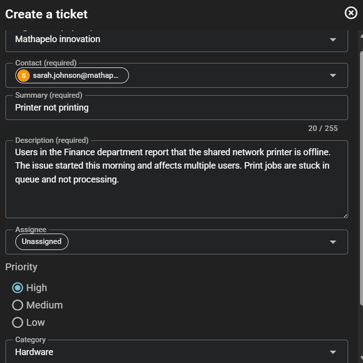
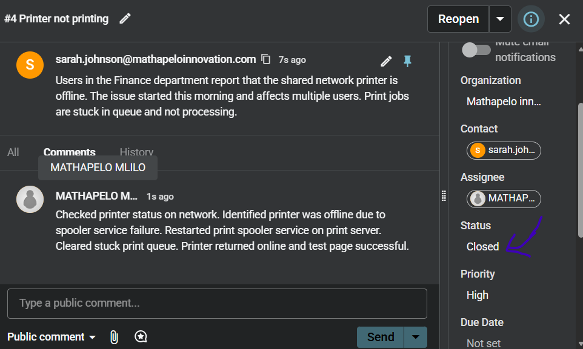
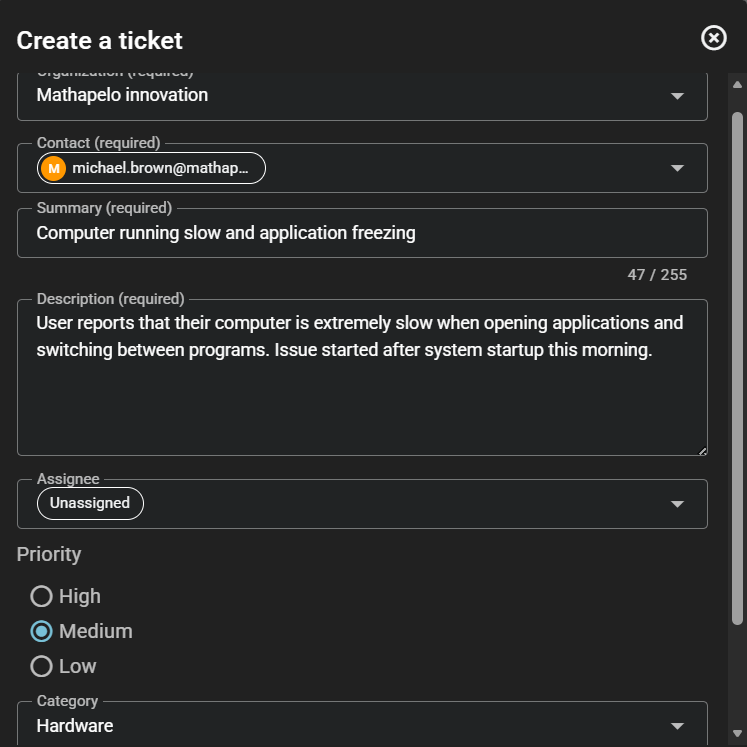
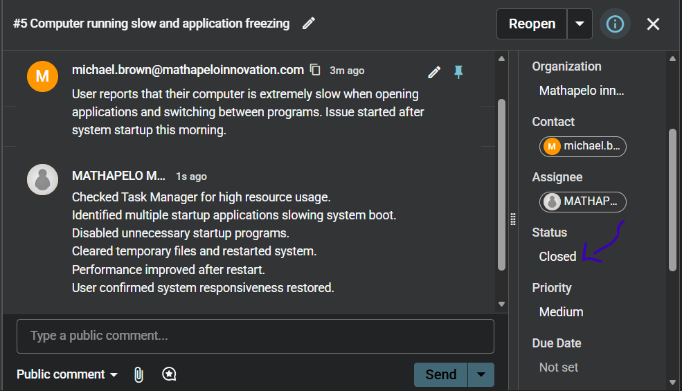

🖥️ IT Help Desk Ticket Resolution Lab (Spiceworks Cloud)
📌 Overview

This project simulates a real-world IT Service Desk environment using Spiceworks Help Desk.

It demonstrates practical IT support skills including incident management, troubleshooting, user support, and ticket resolution workflows.

The lab was designed to replicate 2–3 months of junior IT Support / Service Desk Analyst experience in a corporate environment.

🎯 Objectives:

1.1 Log and manage IT support tickets

1.2 Perform first-line troubleshooting

1.3 Apply incident classification and prioritisation

1.4 Document technical resolutions clearly

1.5 Close tickets following ITIL-style workflow

1.6 Simulate real business IT support operations

🧰 Tools Used:

2.1 Spiceworks Help Desk

2.2 Web-based IT ticketing system

2.3 Basic IT troubleshooting techniques

🏢 Simulated Company Environment

Company Name: Matapelo Innovation
Departments Supported:

Finance
HR
General Operations
👨‍💻 Role Played

IT Support Technician (Service Desk Level 1)

Responsibilities included:

3.1 Handling incoming support requests

3.2 Diagnosing technical issues

3.3 Providing first-line fixes

3.4 Updating ticket statuses

3.5 Documenting resolution 

3.6 Ensuring user issues were fully resolved

🟢 Ticket 1: Microsoft 365 Login Issue
Issue

User unable to log into Microsoft 365 account.

Troubleshooting Steps:

-Verified user account status

-Performed password 

-Confirmed successful login

Resolution:

-User regained access after password reset.

🟡 Ticket 2: Printer Not Printing (Finance Department)
Issue

Shared network printer not printing documents.

Troubleshooting Steps:

-Checked printer connectivity

-Identified print spooler service 

-Restarted spooler service

-Cleared print queue

Resolution:

-Printer restored and printing normally.

🔵 Ticket 3: Slow Computer Performance (HR Department)
Issue

System running slow and freezing during use.

Troubleshooting Steps:

-Checked Task Manager for resource usage

-Disabled unnecessary startup applications

-Cleared temporary system files

-Restarted system

Resolution:

-System performance restored after optimization.

🧠 Key Skills Demonstrated:

🔧 Technical Support

-First-line troubleshooting

-Windows system diagnostics (simulated)

-Printer/network issue resolution

-User account management concepts

📋 IT Service Management

-Incident logging and tracking

-Ticket prioritisation (High / Medium / Low)

-SLA-style resolution handling

-Proper ticket closure process

🗣️ Communication Skills

-Clear technical documentation

-User-friendly issue explanations

-Professional ticket notes

💼 Workplace Readiness

-ITIL-style workflow understanding

-Corporate support simulation

-Multi-department support handling

📸 Screenshot Guidelines (IMPORTANT)

All screenshots should clearly show:

-Ticket summary

-Priority level

-Status (Open / Closed)

-Resolution notes (for resolved tickets)

🚀 What This Project Demonstrates

This project demonstrates real-world ability to:

-Work as a Junior IT Support / Service Desk Technician

-Handle multiple simultaneous IT incidents

-Apply structured troubleshooting methods

-Communicate technical solutions clearly

-Operate within an IT service desk environment

📈 Career Relevance

This lab aligns with roles such as:

-IT Support Technician

-Service Desk Analyst (Level 1)

-Help Desk Technician

-Desktop Support Technician

📌 Author

Name: Matapelo Mlilo
Location: South Africa
Focus: IT Support, Cloud Administration, Help Desk Systems
